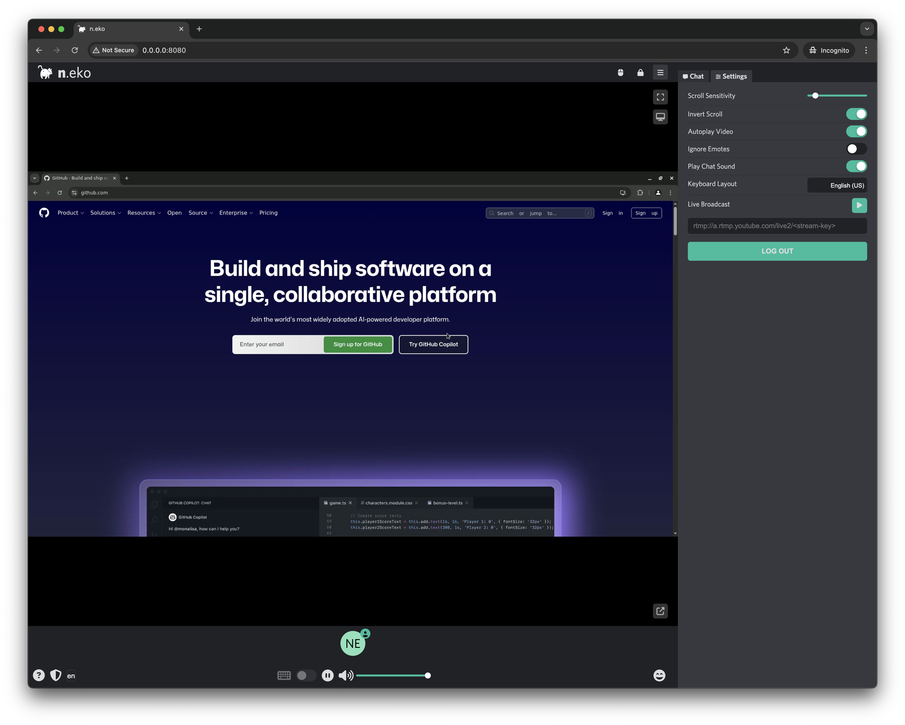

<h1 align=center>Dockette / Neko</h1>

<p align=center>
   🐳 <a href="https://github.com/m1k1o/neko">Neko</a> is a self hosted virtual browser that runs in docker and uses WebRTC.
</p>

<p align=center>
🕹 <a href="https://f3l1x.io">f3l1x.io</a> | 💻 <a href="https://github.com/f3l1x">f3l1x</a> | 🐦 <a href="https://twitter.com/xf3l1x">@xf3l1x</a>
</p>

-----

## Motivation

Forked version supporting Chrome DevTools Protocol.

## Usage

1. Create `docker-compose.yml` file.

Copy [`docker-compose.yml`](./docker-compose.yml) file.

2. Start Docker services.

```
docker compose up
```

3. Open `http://localhost:8080` in your browser. Login `neko` / `admin`.



4. Write your own script to use Chrome DevTools Protocol.

5. Profit.

## Development

See [how to contribute](https://contributte.org/contributing.html) to this package.

This package is currently maintaining by these authors.

<a href="https://github.com/f3l1x">
    
</a>

-----

Consider to [support](https://github.com/sponsors/f3l1x) **f3l1x**. Also thank you for using this package.
